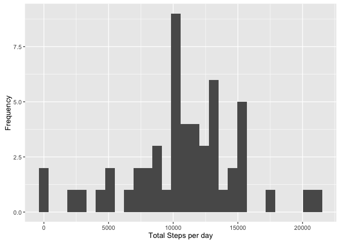
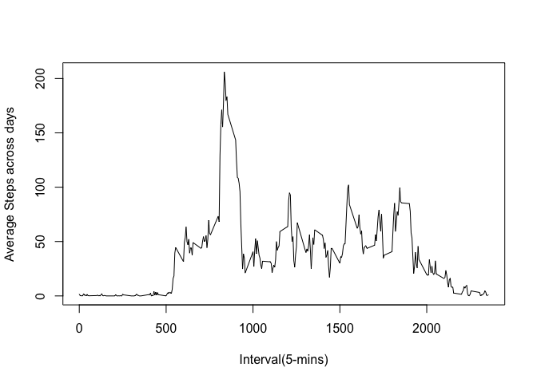
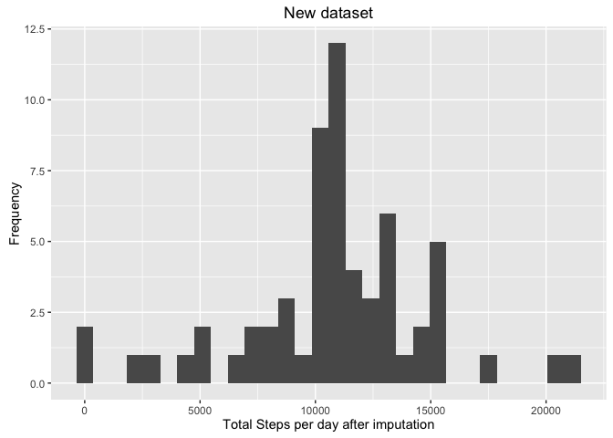
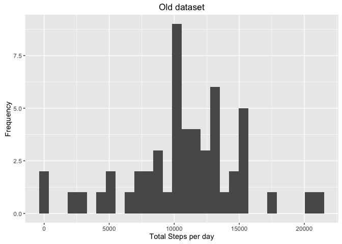
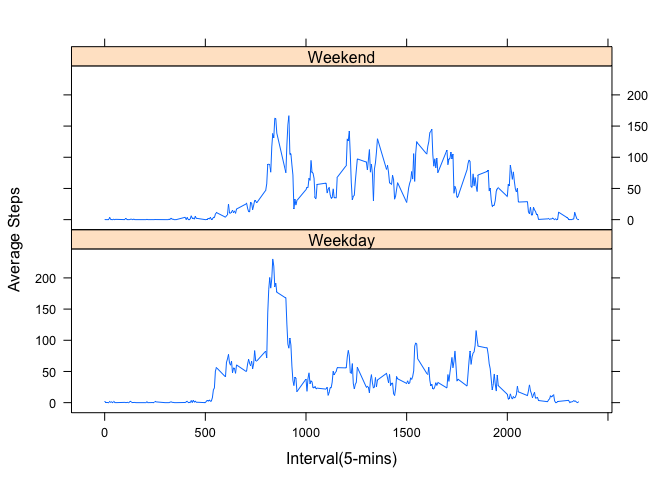

# Reproducible Research: Peer Assessment 1

## Loading and preprocessing the data
### Load library 

```r
library(dplyr)
library(ggplot2)
library(lubridate)
library(lattice)
```

### Load/check data

```r
FileName <- 'activity.csv'
df <- read.table(FileName, sep = ',', header = TRUE, quote = "\"", na.strings = "", stringsAsFactors = FALSE, colClasses = c("numeric", "character","integer"))
str(df)
```

```
## 'data.frame':	17568 obs. of  3 variables:
##  $ steps   : num  NA NA NA NA NA NA NA NA NA NA ...
##  $ date    : chr  "2012-10-01" "2012-10-01" "2012-10-01" "2012-10-01" ...
##  $ interval: int  0 5 10 15 20 25 30 35 40 45 ...
```

```r
dfsub1 <- subset(df, !is.na(df$steps)) # subset of orginal data without missing value
str(dfsub1)
```

```
## 'data.frame':	15264 obs. of  3 variables:
##  $ steps   : num  0 0 0 0 0 0 0 0 0 0 ...
##  $ date    : chr  "2012-10-02" "2012-10-02" "2012-10-02" "2012-10-02" ...
##  $ interval: int  0 5 10 15 20 25 30 35 40 45 ...
```

## What is mean total number of steps taken per day?
First, calculate the total number of steps taken per day, after ignore the missing value:

```r
stepsPerDay <- summarize(group_by(dfsub1, date), stepsPerDay = sum(steps))
print(stepsPerDay)
```

```
## Source: local data frame [53 x 2]
## 
##          date stepsPerDay
##         (chr)       (dbl)
## 1  2012-10-02         126
## 2  2012-10-03       11352
## 3  2012-10-04       12116
## 4  2012-10-05       13294
## 5  2012-10-06       15420
## 6  2012-10-07       11015
## 7  2012-10-09       12811
## 8  2012-10-10        9900
## 9  2012-10-11       10304
## 10 2012-10-12       17382
## ..        ...         ...
```

Histogram of the total number of steps taken per day (used default bin size and width):

```r
ggplot(stepsPerDay, aes(stepsPerDay)) + 
        geom_histogram() +
        labs( x = "Total Steps per day") +
        labs( y = "Frequency")
```

<!-- -->

The mean and median are:

```r
mean(stepsPerDay$stepsPerDay)
```

```
## [1] 10766.19
```

```r
median(stepsPerDay$stepsPerDay)
```

```
## [1] 10765
```
## What is the average daily activity pattern?
calculate the average number of steps taken across all days and then plot in a times series

```r
stepsInt <- summarize(group_by(dfsub1, interval), stepsInt = mean(steps))
print(stepsInt)
```

```
## Source: local data frame [288 x 2]
## 
##    interval  stepsInt
##       (int)     (dbl)
## 1         0 1.7169811
## 2         5 0.3396226
## 3        10 0.1320755
## 4        15 0.1509434
## 5        20 0.0754717
## 6        25 2.0943396
## 7        30 0.5283019
## 8        35 0.8679245
## 9        40 0.0000000
## 10       45 1.4716981
## ..      ...       ...
```

```r
plot(stepsInt$steps ~ stepsInt$interval, type="l", xlab="Interval(5-mins)", ylab="Average Steps across days")
```

<!-- -->

find the row of 5-minute interval that contains the maximum number of steps

```r
stepsInt[which(stepsInt$steps == max(stepsInt$steps)), ]
```

```
## Source: local data frame [1 x 2]
## 
##   interval stepsInt
##      (int)    (dbl)
## 1      835 206.1698
```

## Imputing missing values
### Calculate the total number of missing value in the original dataset

```r
sum(is.na(df)) 
```

```
## [1] 2304
```
### Imputate all the missing values in the dataset, with the mean value in that interval across days

```r
dfNew <- df 
for (i in 1:nrow(dfNew)) {
    if (is.na(dfNew$steps[i])) {
        dfNew$steps[i] <- stepsInt$stepsInt[which(dfNew$interval[i] == stepsInt$interval)]
    }
}
sum(is.na(dfNew))
```

```
## [1] 0
```

```r
str(df) # old dataset summary
```

```
## 'data.frame':	17568 obs. of  3 variables:
##  $ steps   : num  NA NA NA NA NA NA NA NA NA NA ...
##  $ date    : chr  "2012-10-01" "2012-10-01" "2012-10-01" "2012-10-01" ...
##  $ interval: int  0 5 10 15 20 25 30 35 40 45 ...
```

```r
str(dfNew) # new dataset summary
```

```
## 'data.frame':	17568 obs. of  3 variables:
##  $ steps   : num  1.717 0.3396 0.1321 0.1509 0.0755 ...
##  $ date    : chr  "2012-10-01" "2012-10-01" "2012-10-01" "2012-10-01" ...
##  $ interval: int  0 5 10 15 20 25 30 35 40 45 ...
```

### Histogram of total number of steps/day after imputation

```r
stepsPerDayNew <- summarize(group_by(dfNew, date), stepsPerDayNew = sum(steps))
print(stepsPerDayNew)
```

```
## Source: local data frame [61 x 2]
## 
##          date stepsPerDayNew
##         (chr)          (dbl)
## 1  2012-10-01       10766.19
## 2  2012-10-02         126.00
## 3  2012-10-03       11352.00
## 4  2012-10-04       12116.00
## 5  2012-10-05       13294.00
## 6  2012-10-06       15420.00
## 7  2012-10-07       11015.00
## 8  2012-10-08       10766.19
## 9  2012-10-09       12811.00
## 10 2012-10-10        9900.00
## ..        ...            ...
```

```r
ggplot(stepsPerDayNew, aes(stepsPerDayNew)) + 
        geom_histogram() +
        labs( x = "Total Steps per day after imputation") +
        labs( y = "Frequency") +
        labs(title = "New dataset")
```

<!-- -->

```r
ggplot(stepsPerDay, aes(stepsPerDay)) + 
        geom_histogram() +
        labs( x = "Total Steps per day") +
        labs( y = "Frequency") +
        labs(title = "Old dataset")
```

<!-- -->

## Are there differences in activity patterns between weekdays and weekends?


```r
dfNew <- mutate(dfNew, day = factor(weekdays(as.Date(dfNew$date))))
dfNew <- mutate(dfNew, weekday = factor(ifelse(dfNew$day %in% c("Saturday", "Sunday"), "Weekend", "Weekday")))
head(dfNew)
```

```
##       steps       date interval    day weekday
## 1 1.7169811 2012-10-01        0 Monday Weekday
## 2 0.3396226 2012-10-01        5 Monday Weekday
## 3 0.1320755 2012-10-01       10 Monday Weekday
## 4 0.1509434 2012-10-01       15 Monday Weekday
## 5 0.0754717 2012-10-01       20 Monday Weekday
## 6 2.0943396 2012-10-01       25 Monday Weekday
```

```r
str(dfNew)
```

```
## 'data.frame':	17568 obs. of  5 variables:
##  $ steps   : num  1.717 0.3396 0.1321 0.1509 0.0755 ...
##  $ date    : chr  "2012-10-01" "2012-10-01" "2012-10-01" "2012-10-01" ...
##  $ interval: int  0 5 10 15 20 25 30 35 40 45 ...
##  $ day     : Factor w/ 7 levels "Friday","Monday",..: 2 2 2 2 2 2 2 2 2 2 ...
##  $ weekday : Factor w/ 2 levels "Weekday","Weekend": 1 1 1 1 1 1 1 1 1 1 ...
```

```r
stepsIntWeekday <- summarize(group_by(dfNew, interval, weekday), stepsIntWeekday = mean(steps))
head(stepsIntWeekday)
```

```
## Source: local data frame [6 x 3]
## Groups: interval [3]
## 
##   interval weekday stepsIntWeekday
##      (int)  (fctr)           (dbl)
## 1        0 Weekday      2.25115304
## 2        0 Weekend      0.21462264
## 3        5 Weekday      0.44528302
## 4        5 Weekend      0.04245283
## 5       10 Weekday      0.17316562
## 6       10 Weekend      0.01650943
```

```r
str(stepsIntWeekday)
```

```
## Classes 'grouped_df', 'tbl_df', 'tbl' and 'data.frame':	576 obs. of  3 variables:
##  $ interval       : int  0 0 5 5 10 10 15 15 20 20 ...
##  $ weekday        : Factor w/ 2 levels "Weekday","Weekend": 1 2 1 2 1 2 1 2 1 2 ...
##  $ stepsIntWeekday: num  2.2512 0.2146 0.4453 0.0425 0.1732 ...
##  - attr(*, "vars")=List of 1
##   ..$ : symbol interval
##  - attr(*, "drop")= logi TRUE
```

```r
xyplot(stepsIntWeekday ~ interval | weekday, stepsIntWeekday, type = "l", layout = c(1, 2), xlab="Interval(5-mins)", ylab="Average Steps")
```

<!-- -->
